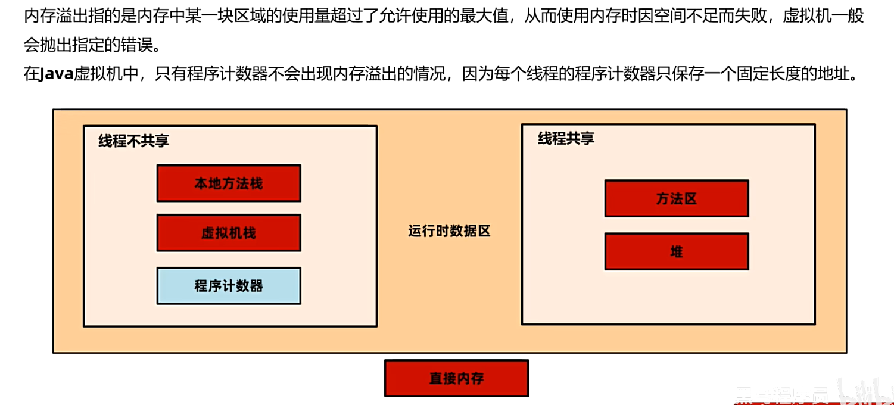
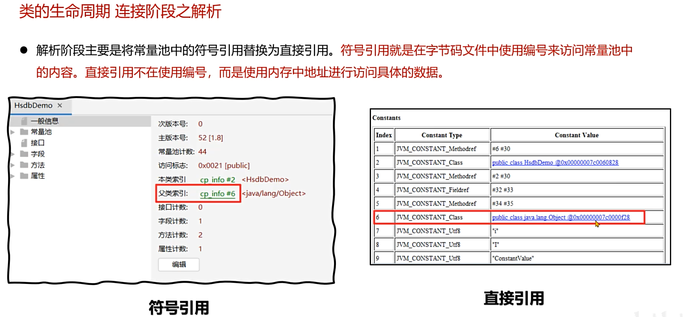

# 1. 什么是类加载器

作用：类加载器在类加载的过程中，将字节码信息以流的方式加载到内存中。

* 启动类加载器：JDK9之后用java写。
* 拓展类加载器：加载jre/lib/ext目录之下的jar包
* 应用类加载器：加载classpath下的类
* 自定义加载器：子定义一个类加载器，继承classload类。重写findClass方法。

> findClass方法会调用defineClass方法，在堆上开辟空间

### **自定义类加载器**

# 2. 什么是双亲委派机制

### 父类加载器

### 双亲委派机制

回答：**双亲委派机制就是当一个类加载器在加载类的时候，会首先判断自己有没有加载过这个类，如果加载过就直接返回，没有加载过就会向上查找是否父类加载过，再由顶向下进行加载。**

### 双亲委派的作用

* 保证类加载的安全性，防止恶意代码替换JDK的核心类，确保核心类的安全性。（案例：自己编写的java.lang.String想要覆盖）
* 避免重复加载，避免一个类被多次加载。

# 3. 如何打破双亲委派机制

>  不要进行向上查找的过程，就让这个加载器来加载，能加载就加载，不能加载就抛异常

**在源码的第一步就是判断这个类自己有没有加载过。**

**实现双亲委派机制的代码**

> 这里面需要注意findBootstrapClassOrNull（）方法是两个功能的合并，先查找加载过没有，没有就紧接着进行加载

**查找到最上头后还是没有人加载过，就执行下面这段findClass，每个类加载器加载不了就向子类抛异常，让子类去加载，最后由可以加载的类加载器进行finclass方法，里面会调用defineClass方法进行堆内存分配。**

**回答：实现自定义类加载器，重写loadClass方法，把原生的双亲委派机制的代码去掉**

# 4. 如何判断堆上的对象没有被引用

* 引用计数法
* 可达性分析

### 引用计数法

优点：简单，维护一个计数器

缺点：会导致循环引用，导致对象无法回收

**由于无法回收，导致了内存泄漏**

### 可达性分析算法

# 5. jvm中有哪些引用类型

* 强
* 软
* 弱
* 虚

 

# 6. TheadLocal中为啥使用弱引用

# 7. 垃圾回收算法

垃圾回收做两件事：

1.找到内存中存活的对象

2.释放不再存活的对象

* 标记清除
* 标记整理
* 复制
* 分代GC

### Stop The World

### 算法评价标准

* 吞吐量      100分钟 99分钟执行用户代码  1分钟GC
* 最大暂停时间   STW时间
* 堆使用效率   从堆的使用效率来说标记清楚算法要优于复制算法，应为复制算法只能利用一半的堆内存

### 标记清除算法

通过GC Root引用链打上存活对象的标记，然后清除。

优点：简单，只需要维持一个标志位

缺点：

* 碎片化问题

* 分配速度慢：维护一个空闲空间的链表

  

### 复制算法

### 标记整理算法

为标记清除算法容易产生碎片的缺点进行优化

### 分代回收

**内存划分   新生代用复制算法实现，eden：s0：s1 为 8：1：1**

* 分代回收的流程

**分代回收的时候，创建出来的对象首先会放到Eden区，随着对象的创建，Eden区越来越满，这样的话爆满后就会出发年轻代的GC，称为Minor GC，通过可达性分析将Eden区和from区存活的对象放到To区，并且回收不存活的对象，此时交换form，to区且Eden区已经清空，然后新对象就可以放到Eden区了，而且每一次minorGC后，jvm会为每个存活的对象记录一个年龄。**

**当老年代放不进去的时候，会先进行年轻代的回收。因为有那么一种情况：就是当年轻代内存不够用的时候来了一个新对象，然后minorGC，但是minorGC后年轻代还是不够用，此时年轻代的对象都在GC Root上且年龄达不到放到老年代的要求，所以这个年龄很小的对象就会直接放到老年代，所以老年代不够用的时候，会先去minorGC一下，避免这种对象的跨年龄放入老年代。**

**当这种情况持续下去，老年代渐渐爆满，又来一个对象，先进去Eden区，Eden区满着呢，进行Minor GC，由于此时还和之前一样，所有对象还是都在GC Root链上且年龄达不到，所以还是回收不了，那这个新对象就会和刚才其他对象一样直接放入老年区。此时问题出现了，虽然我老年代容忍你跨年龄进来，但是我都满了你还在跨年龄进来太不礼貌了，所以此时进行一次minorGC，尽量让他先去年轻代带着。如果此时还是年轻代还是容不下它，而老年代也满了。就会触发Full GC对整个堆进行回收，此时STW就会比较长，如果Full GC依然无法回收老年代的对象，当再有是对象进入老年代的时候就会OOM**

# 8. 有哪些常用的垃圾回收器

### Serial+SerialOld

### PS+PO

### ParNew+CMS

### G1

**参数：-XX:+UseG1GC**

G1的内存结构并不是连续的，被划分了许多空间。G1不同于其他垃圾回收器，G1是对整个堆进行回收，采用复制算法对每个区域进行回收

G1垃圾回收有两种：

* 年轻代回收（Young GC）：主要针对年轻代区域的垃圾回收，包括Eden区和Survivor区。当所有Eden区使用率达到最大阀值（默认60%）或者G1计算出来的回收时间接近用户设定的最大暂停时间时，会触发一次Young GC，回收Eden区和Survivor区，复制移动到另外的Survivor幸存者（年龄+1）或Old老年代区（提前晋升的）
  
* 混合回收 （Mixed GC）：Mixed GC是G1垃圾回收器独有的，也称混合回收，针对年轻代和部分老年代区域的垃圾回收。当老年代的占有率达到阀值（默认45%）或年轻代被分配大对象时，会触发一次Mixed GC，回收所有年轻代和一部分老年代区（选取的策略是垃圾对象最多的老年代区域，确保释放更多内存空间，即回收价值高的），控制最大暂停时间。
  

# 9. 如何解决内存泄漏

**最主要的是前两步**

# 10. 常见的JVM参数

* 最大堆内存
* 最大栈内存
* 最大元空间内存
* 日志参数
* 对内存快照
* 

 

# 11. 什么是JVM	

* 定义：JVM指 Java Virtual Machine.本质上是一个运行再计算机上的程序。
* 职责：运行字节码文件

* 作用：为了支持Java中的 Write Once Run Anywhere；编写一次，到处运行的跨平台特性。

* 功能：

回答：

* 1. JVM是java虚拟机，本质上是运行在计算机的一个程序，它的职责是运行字节码文件，作用是支持java的跨平台特性。

* 2. JVM的功能有三项：第一是解释并执行字节码文件，第二是管理内存中对象的分配完成自动的垃圾回收，第三是优化热点代码提高至执行效率

* 3. JVM的组成部分为：类加载子系统、运行时数据区、执行引擎、本地接口

* 4. 常用的JVM是Oracle提供的HotsPot虚拟机

  

# 12. 有没有了解过字节码文件的组成

**魔数：ca fe ba be**

主版本号-44 = jdk版本

# 13. 运行时数据区

* 程序计数器：控制指令的运行，实现分支跳转；保存当前要执行的字节码的地址
* 栈：存放调用的方法的栈帧。
* 堆：存放对象、线程共享
* 方法区

### 栈

**每个线程都有自己的一块独立的占内存空间**

每个方法的调用会进行一次栈帧的压栈：栈帧的组成分为三部分：局部变量表、操作数栈、帧数据

**局部变量表实际上是一个数组**

### 堆

### 方法区

回答：运行时数据区是jvm所管理的内存区域，卡伊按照线程的共享分为两大类：

* 线程共享：堆和方法区
* 线程不共享：本地方法栈、虚拟机栈、程序计数器

# 14. 在哪些地方可以出现内存溢出

### 堆溢出

### 栈溢出

### 方法区溢出

### 直接内存

# 15. JDK6-8的内存结构的不同

### 方法区的实现

以前在堆里面找一块空间设置为永久代实现方法区，收到堆大小的限制，jdk8之后直接将直接内存里开一块空间使用元空间实现方法区，收到操作系统的内存大小的限制，格局一下子打开。这样可以提高内存上限

### 字符串常量池的位置

### JDK6

**方法区在堆中，存放类的元信息和字符串常量池和运行时常量池**

### JDK7

**JDK7将字符串常量池从方法区中拿出来放在了堆里面，方法区里面存放类的元信息和运行时常量池**

### JDK8

**JDK8将方法区移动到了系统空间的直接内存上，字符串常量池和JDK7一样在堆上，方法区里卖弄存放类的元信息和运行时常量池**

# 16. 类的生命周期

### 加载

### 连接

1. 验证：做校验工作 例如魔数
2. 准备：为静态变量设置初值，如果是final就一步到位

3. 解析：将符号引用转换为直接引用

   

### 初始化

为静态变量赋值，其实在连接阶段的准备阶段给静态变量赋了初值，现在是更改初值

结果是2

如果打开new Demo，就会在执行clinit方法后去执行类的init方法，构造代码块是在创建对象的时候执行，所以此时结果是3

### 使用

...

### 卸载

类的卸载很严格

### 总结

