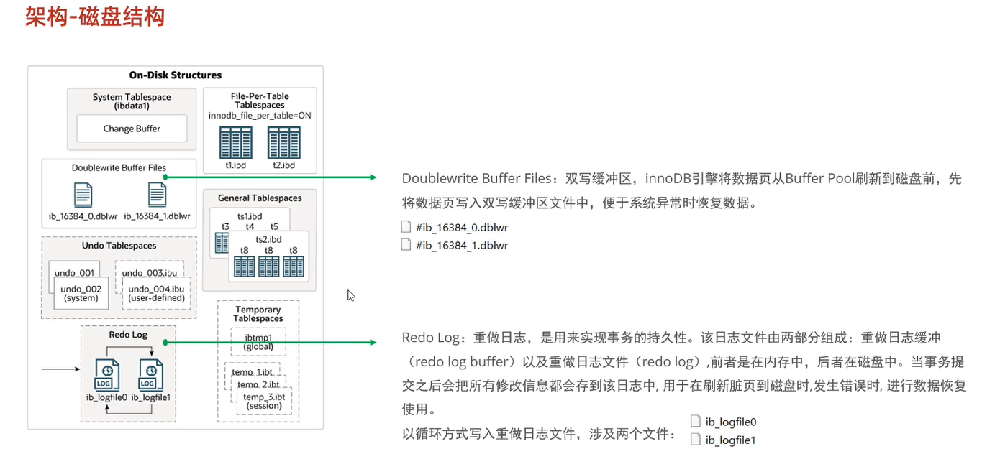

## 多表查询

#### 内连接

* 隐式内连接

表结构：emp，dept

连接条件：emp,dept_id = dept.id

```sql
-- 1
select * from emp , dept where emp.dept_id = dept.id
-- 2
select emp.name, dept.name from emp , dept where emp.dept_id = dept.id
-- 3 起个别名
select e.name, d.name from emp e , dept d where e.dept_id = d.id
-- 4 起个别名 就不能使用表名来限定字段了  因为先执行的是from 后where
select e.name, d.name from emp e , dept d where emp.dept_id = dept.id
```

* 显示内连接

... inner join ... on ...

表结构：emp，dept

连接条件：emp,dept_id = dept.id

```sql
-- 1
select e.name , d.name from emp e inner join dept d on e.dept_id = d.id
-- 2 inner可以省略
select e.name , d.name from emp e join dept d on e.dept_id = d.id
```


#### 外连接


* 左外连接

表结构：emp，dept

连接条件：emp,dept_id = dept.id

查询emp的所有数据和dept的交集

```sql
-- 这条语句会把emp和dept的所有列全部拿过来  有两列id
select * from emp e left outer join dept d on e.dept_id = d.id
-- 筛选一下只要empt的所有和dept的name
select e.*, d.name from emp e left outer join dept d on e.dept_id = d.id
```

* 右外连接

查询dept表的所有信息和对应的员工信息

```sql
select d.*, e.* from emp e right outer join dept d on e.dept_id = d.id
```

改成左外

```sql
select d.*, e.* from dept d left outer join emp e on e.dept_id = d.id
```

#### 自连接


查询员工信息和所属领导信息

```sql
-- 用内连接是查的交集   如果有的人没有领导  交集里面就没有他
-- 隐式
select a.*, b.name from emp a, emp b  where a.managerid = b.id
-- 显式
select e.*, b.name from emp e join emp b on e.managerid = b.id
```

```sql
-- 用外连接  这样就可以包含所有的员工了  即使他没有领导  
select a.name '员工', b.name '领导' from emp a left join emp b on a.managerid = b.id
```

### 联合查询


```sql
-- 查询薪资低于5000的员工 和年龄大于50的员工

-- 直接合并了
select * from emp where salary < 5000
union all
select * from emp where age > 50

-- 去重  union是去重  union all是直接合并
select * from emp where salary < 5000
union
select * from emp where age > 50
```


### 子查询


```sql
-- 2 4
select id from dept where name = '销售部' or name = '市场部'
select * from emp where dept_id in (2,4)

select * from emp where dept_id in (select id from dept where name = '销售部' or name = '市场部')
```


all 是必须子查询返回来的所有值都必须满足这个条件


* 表子查询


子查询用作临时表


去重关键字 **distinct**


## sql性能

```sql

-- 查看全局状态  各个语句的执行次数
show GLOBAL STATUS LIKE 'Com_______';

SELECT * from question;

-- 慢查询日志

-- 查看慢查询日志是否开启
SHOW VARIABLES like 'slow_query_log';

-- # 开启MySQL慢日志查询开关 
-- slow_query_log=1
-- # 设置慢日志的时间为2秒，SQL语句执行时间超过2秒，就会视为慢查询，记录慢查询日志 
-- long_query_time=2
-- slow_query_log_file = "D:/MySQL/mysql_slow_query.log"


-- PROFILE
-- 查看数据库是否支持profile
select @@have_profiling; 
-- 开启profile
SET profiling=1;

-- 执行一些操作使得profiling可以追踪
select COUNT(*) FROM question;

SHOW PROFILES;
-- 从里面可以得到根据name查要比根据id慢好多，是因为，id是聚合索引，name是二级索引，需要回表查询。


-- 查询指定id的sql语句耗时
show PROFILE for QUERY 39;


-- EXPLAIN执行计划
-- 可以在任何select前面加上explain,查看此sql的执行计划
EXPLAIN SELECT * FROM question WHERE id = 1;

```

## 索引

### 索引分类

* 按照数据结构分类：B+树索引、HASH索引
* 按照物理存储分类：聚簇索引、二级索引
* 按照字段特性分类：主键索引、唯一索引、普通索引、前缀索引
* 按照字段个数分类：单列索引、联合索引

### 索引使用

```sql
-- 索引使用
-- 最左前缀法则，使用的时候必须包含索引最左边的列

-- 在使用> < 范围查询的时候，右边的索引失效。尽量使用大于等于来规避索引失效的情况

-- 不要在索引列上进行运算  索引将会失效

-- 尾部模糊索引不会失效，头部模糊 索引失效

-- 用 or 左右都有索引的时候才会生效

-- 数据分布影响，查大部分数据走全表扫描，小部分数据走索引

-- SQL提示
-- use index(idx_name)     用哪个  只是建议 不一定使用
-- ignore index(idx_name)  不要用那个
-- force index (idx_name)  必须用某个

-- 覆盖索引
-- using index condition  使用了索引还要回表
-- using where using index  索引列就能找到
-- 覆盖索引就是可以在索引列中找到所需要的数据，不需要回表查询，所以尽量少使用select *, 因为它很容易出现回表查询
-- 查询的字段里面如果使用的索引或者联合索引找不到的话，就需要根据id去聚合索引中回表查找


```


建立 id, username, password三个字段的联合索引，叶子节点挂的就是id，不需要回表查询。

------


```sql
-- 前缀索引  只将字符串一部分当作索引   解决长文本字段和大字符串的索引的时候  索引体积过大，浪费磁盘IO的情况
create index idx_xxx on table(column(n));
-- n为指定的字符数量


-- 单列索引和联合索引选择使用
-- 推荐使用联合索引   在使用两个单列索引的时候，mysql会之只使用一个索引，效率比较高的那个

```


**聚簇索引默认是主键索引，如果没有这个主键索引，就会去找第一个唯一索引，都没有就会生成一个默认的row_id作为聚集索引**


## SQL优化

### Explain


### insert

* 批量插入
* 手动提交事务
* 主键顺序插入
* 大批量加载  load命令

### 主键

* 主键尽量短
* 顺序插入
* AUTO_INCREMENT	比UUID好，更短且顺序插入

### order by

* use index
* use filesort

使用use index 效率高

### limit

问题在于 limit 9000000 10，此时数据库需要排序前9000000 记录，然后返回9000001-9000010，查询代价太大

```sql
-- 耗时太久
select * from tb_user limit 9000000,10;

-- 对其优化
-- 覆盖索引加子查询
-- 1. 拿到id
select id from tb_user order by id limit 9000000,10;
-- 2. 拿到数据，由于in后面不支持limit  
-- 不支持：select * from tb_user where user_id in (select id from tb_user order by id limit 9000000,10)
-- 把这句结果 select id from tb_user order by id limit 9000000,10; 当作一个表，通过多表联查。
select u.* form tb_user u, (select id from tb_user order by id limit 9000000,10) a where u.id=a.id;
-- 返回的时候只需要返回u的内容即可
-- 子查询是覆盖索引，主查询是聚集索引，避免了回表查询，这样实现了limit的优化

```

### count

```sql
-- innodb 执行count(*) 时，会一行一行读，非常耗时
count(*)     查询总记录数   不会取值。服务层直接按行累加
count(主键)   查询总记录数  取到每一行的主键值， 直接按行累加
count(字段)  返回这个字段不为null的条数   首先看看此字段有没有not null约束，如果有，引擎会把每一行的字段值拿出来，直接按行累加，如果没有，拿出来后就需要判断是否为null，累加不为null的 
count(1)     返回的每一条记录都放会一个1进去，对这个1累加  引擎不取值，但是服务层会对返回的每一行放一个1进去，进行累加

count(字段) < count(主键) < count(1) ~ count(*) 
```

### update

```sql
-- innodb 三大特性  事务 外键 行级锁
-- update语句的时候，如果where后面跟的不是索引，就会把把整个表锁住。没有索引相当于扫面整张表，行锁升级为表锁  导致并发性能降低
update tb_user set name = "JAVA" where name = "JAVAEE";
-- 所以更新字段的时候尽量使用索引更新

-- 可以先为name创建索引
create index idx_user_name on tb_user(name);
-- 再执行一样的语句  此时就是行锁
update tb_user set name = "JAVA" where name = "JAVAEE";
```

## 锁

* 全局锁：所有表。对整个数据库实例加锁，处于只读状态  对数据库进行备份的时候，加全局锁，不加的话可能出现数据不一致性。

  缺点是，一旦上锁，全局停摆。

* 表级锁：一张表。

  * 表锁

    * 表共享读锁（readLock）：不会阻塞其他的读，但是阻塞其他的写

      ```sql
      lock tables tb_user read; 
      unlock tables;
      ```

    * 表独占写锁（writeLock）：只对当前客户端能读写，其他客户端全部不允许

      ```sql
      lock tables tb_user write;
      unlock tables;
      ```

  * 元数据锁：自动加锁，维护表结构

  * 意向锁：在更新的时候会加上行锁，再加上一个意向锁，客户端2来加表锁的时候，直接看意向锁兼容不兼容，不兼容就阻塞，兼容就加锁。这样加表锁的时候不用逐行检查行锁了。（他是针对行锁和表锁的，避免表锁和行锁的冲突，他是自动加的）

    * 意向共享锁（IS）：与表锁共享读锁兼容，与表锁排他写锁互斥

    * 意象排他锁（ES）：与表锁共享读锁表锁排他写锁都互斥

* 行级锁：某一行，锁的粒度最小。并发度最高

  > innodb的数据是基于索引组织的，聚集索引挂的是行数据，二级索引是ID。

  * 行锁：锁住单个行记录。**innodb中的行锁是针对索引列加锁，如果查询的条件不是索引，会升级为表锁**，会成为全表扫描

    * 共享锁
    * 排他锁

    ```sql
    select -- 不加任何锁
    select ... Lock in share mode   -- 加共享锁
    update -- 排他锁
    insert -- 排他锁
    delete -- 排他锁
    ```

  * 间隙锁：锁住索引间隙，在InnoDB中，**间隙锁**（Gap Lock）是为了防止**幻读**（Phantom Read）现象而引入的锁机制

    * 具体来说，间隙锁并不是锁定已存在的行，而是锁定行之间的“空隙”，即：

      如果查询条件为某个范围（例如 `SELECT * FROM table WHERE column > 10 AND column < 50`），那么间隙锁会锁定从 `column = 10` 到 `column = 50` 之间的“间隙”区域，防止其他事务在这个间隙中插入新的行。

    * 间隙锁的唯一目的就是锁住此记录之前的间隙，防止别的事务进行修改，防止幻读

  * 临键锁：行锁和间隙锁的组合

### 概述

锁是在并发访问时，解决数据一致性和有效性问题。全局锁、表级锁、行级锁

## InnoDB存储引擎


### 架构


#### 内存结构


**Change Buffer相当于缓冲区的缓冲区**


**Innodb支持自适应hash**


#### 磁盘结构



#### 后台线程


在操作数据的时候会现在缓冲区进行操作，如果缓冲区没有数据也会先加载进来，缓冲区内的数据也会以一定的频率刷新回去磁盘

### 事务原理

**事务时一组操作的集合，是不可分割的工作单位。事务会把所有的操作作为一个整体一起向系统提交或者撤销操作，要么同时成功，要么同时失败。**

**ACID**


持久性：当我们进行**数据操纵语言**（DML，Data Manipulation Language）语句的时候，如果缓冲区没有我们操作的页，会通过后台线程从磁盘加载，然后我们对目标页进行操纵，完毕后这个页就变成了脏页，当我们回写的时候，如果出现事故，就会出现数据的持久性得不到保障的问题，此时需要redoLog来帮忙。他会记录操作页的变化**（记录的是物理日志，也就是变化的数据）**，记录到redoLog文件中，然后追加到磁盘中，脏页不着急回写，因为磁盘现在有它的重做日志。为什么不直接将脏页写回而时写回redoLog呢，因为我们的操作都大不是顺序的，随机的IO性能太差，而redoLog是追加，是顺序IO，性能较好。


### MVCC


**MVCC，多版本并发控制，维护一个数据的多个版本，允许多个事务同时读同一行的数据，而不会彼此阻塞。**


#### 隐藏字段


undoLog版本链表头部是最新的记录，尾部是最旧的记录

#### readview


#### 版本链规则


