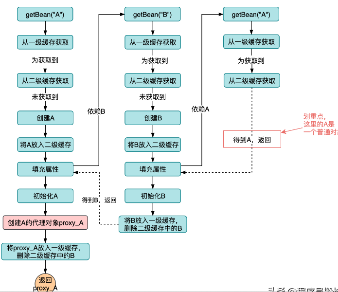
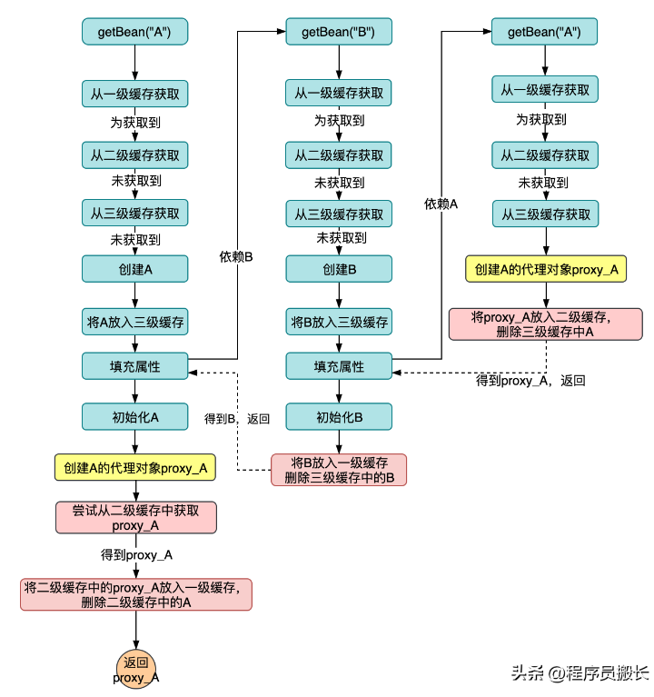

# 一、为什么使用三级缓存破解循环依赖



两级就够了其实，但是这样的话会将已经创建好的和正在创建的bean放在一起，层次不分明。还有一个重要的问题是代理对象的循环依赖，我们b依赖的a是一个普通的a，而最后存到单例池中的a是一个代理的a，这就造成了依赖不一致的问题



三级缓存是存入一个工厂，再我们放入二级缓存的时候就判断是否需要代理，需要的话就把代理放入二级缓存，这样最后b获取的是a的代理，最后a想要获取代理的时候，也会先去二级缓存找一下，如果有就是用这个代理就行，保证最后是一个a代理。

# 二、什么是spring IOC

**IOC 通过将对象的创建和管理交给 Spring 容器，而不是由应用程序代码自己控制，来实现控制反转的思想。具体来说，IOC 允许开发者将应用程序中的对象依赖关系交给框架来处理，从而解耦对象之间的关系。程序代码只要配置和声明所需要的依赖项，容器会自动注入。**

**Spring IOC（Inversion of Control，控制反转）** 是 Spring 框架的核心概念之一，它是实现 **依赖注入（Dependency Injection，DI）** 的基础。IOC 通过将对象的创建和管理交给 Spring 容器，而不是由应用程序代码自己控制，来实现控制反转的思想。具体来说，IOC 允许开发者将应用程序中的对象依赖关系交给框架来处理，从而解耦对象之间的关系。

### **1. 什么是控制反转（IOC）？**

**控制反转（Inversion of Control，IOC）** 是指将对象的控制权从程序本身反转到外部容器中。传统的编程方式是应用程序代码直接创建和管理对象（比如通过 `new` 关键字），而在 IOC 中，对象的创建和管理由外部容器负责，程序代码只需要声明所需的依赖项，容器会自动将依赖注入到对象中。

在 Spring 中，IOC 容器（通常是 `ApplicationContext` 或 `BeanFactory`）负责创建和管理对象，并且管理它们之间的依赖关系。

ApplicationContext丰富了BeanFactory，增加了一些功能，比如国际化等等。

### **2. 依赖注入（DI）与 IOC**

**依赖注入（Dependency Injection，DI）** 是实现 **控制反转（IOC）** 的一种方式。在 Spring 中，IOC 容器会负责注入对象的依赖，而不是由对象自己去创建或获取依赖。

依赖注入有三种方式：

- **构造器注入**：通过构造函数将依赖项传入对象。
- **Setter 注入**：通过 setter 方法注入依赖项。
- **字段注入**：直接通过字段进行依赖注入（一般使用反射）。

### **3. Spring IOC 的核心组成**

Spring IOC 容器有两个核心组件：**BeanFactory** 和 **ApplicationContext**。其中，`ApplicationContext` 是 `BeanFactory` 的子接口，提供了更丰富的功能，适用于大多数应用场景。

- **BeanFactory**：最基本的容器，它提供了基本的 IOC 功能，负责加载配置文件并创建和管理 Bean。
- **ApplicationContext**：比 `BeanFactory` 更强大，除了基本的 IOC 功能外，还提供了 AOP、事件监听、国际化支持等高级功能。大多数应用程序使用的是 `ApplicationContext`。

### **4. Spring IOC 容器的工作流程**

1. **配置文件或注解声明 Bean**：在 Spring 中，你可以通过 XML 配置文件、Java 注解或者 Java 配置类来声明和配置 Bean。
   
   - **XML 配置**：
     ```xml
     <bean id="myBean" class="com.example.MyBean">
         <property name="propertyName" value="value"/>
     </bean>
     ```
   - **注解配置**：
     ```java
     @Component
     public class MyBean {
         @Autowired
         private AnotherBean anotherBean;
     }
     ```

2. **容器初始化**：当 Spring 应用启动时，IOC 容器会根据配置加载所有的 Bean 定义，并初始化 Bean 对象。

3. **依赖注入**：在容器创建 Bean 的过程中，IOC 容器会根据 Bean 的依赖关系，自动注入相应的依赖（如构造函数、setter 方法或字段注入）。

4. **Bean 的生命周期管理**：Spring 容器还负责管理 Bean 的生命周期，例如创建、初始化、销毁等。

### **5. 示例：Spring IOC 使用构造器注入**

假设我们有两个类：`Car` 和 `Engine`，其中 `Car` 依赖 `Engine`。

#### **1. 定义 Bean 类：**
```java
public class Engine {
    public void start() {
        System.out.println("Engine is starting...");
    }
}

public class Car {
    private Engine engine;

    // 使用构造器注入
    public Car(Engine engine) {
        this.engine = engine;
    }

    public void drive() {
        engine.start();
        System.out.println("Car is driving...");
    }
}
```

#### **2. 配置 Spring 容器（XML 配置方式）：**
```xml
<beans xmlns="http://www.springframework.org/schema/beans"
       xmlns:xsi="http://www.w3.org/2001/XMLSchema-instance"
       xsi:schemaLocation="http://www.springframework.org/schema/beans
           http://www.springframework.org/schema/beans/spring-beans.xsd">

    <!-- 定义 Engine Bean -->
    <bean id="engine" class="com.example.Engine"/>

    <!-- 定义 Car Bean，构造器注入 Engine -->
    <bean id="car" class="com.example.Car">
        <constructor-arg ref="engine"/>
    </bean>
</beans>
```

#### **3. 使用 ApplicationContext 获取 Bean：**
```java
public class MainApp {
    public static void main(String[] args) {
        // 加载 Spring 配置文件
        ApplicationContext context = new ClassPathXmlApplicationContext("beans.xml");

        // 获取 Car Bean，并调用方法
        Car car = (Car) context.getBean("car");
        car.drive();  // 输出：Engine is starting... Car is driving...
    }
}
```

在这个例子中，Spring IOC 容器会自动管理 `Car` 和 `Engine` 对象的创建，并且通过构造器注入将 `Engine` 注入到 `Car` 中。

### **6. Spring IOC 容器的好处**

1. **解耦合**：Spring 容器管理对象的创建和依赖关系，使得业务逻辑类不再依赖于具体的实现类或依赖对象，从而实现了 **松耦合**。
2. **可维护性**：随着系统的扩展，依赖注入使得修改和扩展代码变得更加容易，增加新的功能不需要修改现有代码。
3. **测试友好**：通过 IOC 和 DI，可以更容易地对对象进行单元测试。可以方便地使用模拟对象（Mock Objects）来注入依赖。
4. **生命周期管理**：Spring 容器管理 Bean 的生命周期，开发者无需关注对象的创建和销毁问题。
5. **统一管理**：Spring 容器提供了统一的 Bean 管理和配置方式，可以通过 XML、注解、Java 配置类等多种方式进行配置，增加了灵活性。

### **7. 总结**

- **Spring IOC** 是一种设计模式，指将对象的创建和管理交给 Spring 容器，而不是由应用程序控制。
- **依赖注入（DI）** 是实现 **IOC** 的一种技术，它允许对象声明所需的依赖，容器会自动注入。
- Spring IOC 使得系统更加松耦合、易扩展、易维护，并且便于单元测试。

# 三、什么是spring bean

bean是spring中的一个概念，他是spring容器管理的对象，

**Spring Bean** 是 Spring 框架中的一个核心概念，它是 **Spring IOC 容器** 管理的对象。在 Spring 中，所有的对象（包括服务对象、数据访问对象等）都是由 Spring 容器创建和管理的，这些对象被称为 **Bean**。

Spring Bean 是通过 **依赖注入（DI）** 机制来管理其生命周期和依赖关系的。Spring 容器通过配置文件、注解或 Java 配置类来定义和管理这些 Bean，从而使得应用程序的各个部分彼此解耦，并提升了代码的可维护性和可扩展性。

### **1. 什么是 Spring Bean？**

Spring Bean 是由 Spring 容器（通常是 `ApplicationContext`）所管理的对象。在 Spring 中，Bean 是指由 Spring 容器创建、配置和管理的 Java 对象。

每个 Bean 都有一个生命周期，由 Spring 容器控制。容器会根据配置文件（XML 配置、注解、Java 配置类等）自动实例化 Bean，并将所需的依赖注入到 Bean 中。

### **2. Spring Bean 的特点**

1. **管理生命周期**：Spring 容器负责创建、初始化和销毁 Bean 的过程。Bean 的生命周期可以通过配置进行定制。
2. **依赖注入**：Spring 容器根据配置（如构造器注入、setter 注入、字段注入）将所需的依赖注入到 Bean 中，从而实现松耦合。
3. **作用域**：Spring 支持多种作用域（如单例、原型、请求、会话等）来管理 Bean 的实例。
4. **配置灵活性**：Bean 可以通过 XML 文件、Java 注解、Java 配置类等方式进行定义和配置。

### **3. 如何定义 Spring Bean？**

Spring Bean 可以通过不同的方式进行定义和配置，常见的方式有 **XML 配置**、**注解方式** 和 **Java 配置类**。

#### **3.1. XML 配置方式**

在 Spring 经典的 XML 配置文件中，使用 `<bean>` 标签来定义 Bean。每个 `<bean>` 标签代表一个 Bean，`id` 属性指定 Bean 的名称，`class` 属性指定 Bean 的类。

```xml
<beans xmlns="http://www.springframework.org/schema/beans"
       xmlns:xsi="http://www.w3.org/2001/XMLSchema-instance"
       xsi:schemaLocation="http://www.springframework.org/schema/beans
                           http://www.springframework.org/schema/beans/spring-beans.xsd">

    <!-- 定义一个 Bean -->
    <bean id="myBean" class="com.example.MyBean">
        <property name="property1" value="value1"/>
        <property name="property2" value="value2"/>
    </bean>

</beans>
```

在这个例子中，Spring 容器会创建一个 `com.example.MyBean` 类型的对象，并将其作为 `myBean` 存储在容器中。Spring 会自动将 `property1` 和 `property2` 注入到 `MyBean` 对象中。

#### **3.2. 注解方式**

在 Spring 通过注解进行配置时，通常会使用 `@Component`、`@Service`、`@Repository`、`@Controller` 等注解来标识 Bean 类。然后通过 `@Autowired` 注解来自动注入依赖。

```java
import org.springframework.beans.factory.annotation.Autowired;
import org.springframework.stereotype.Component;

@Component
public class MyBean {
    private String property1;

    @Autowired
    public MyBean(String property1) {
        this.property1 = property1;
    }

    // Getter 和 Setter
}
```

在上述代码中，`@Component` 注解标记 `MyBean` 类为一个 Spring Bean。`@Autowired` 注解表示 `property1` 会由 Spring 自动注入。

#### **3.3. Java 配置类方式**

在 Java 配置类中，通过 `@Configuration` 和 `@Bean` 注解来定义 Spring Bean。

```java
import org.springframework.context.annotation.Bean;
import org.springframework.context.annotation.Configuration;

@Configuration
public class AppConfig {

    @Bean
    public MyBean myBean() {
        return new MyBean("value1");
    }
}
```

在这个例子中，`@Configuration` 注解表示 `AppConfig` 类是一个配置类，`@Bean` 注解用于标记方法，它返回的对象会被注册为 Spring Bean。

### **4. Spring Bean 的生命周期**

Spring Bean 的生命周期包括 **创建、初始化、销毁** 等阶段。Spring 容器会在 Bean 创建、使用和销毁过程中进行一些管理。你可以通过一些钩子方法来定制这些生命周期阶段。

#### **4.1. Bean 的创建**

Spring 容器会根据配置文件或注解配置自动创建 Bean。Bean 的创建过程包括：

- **实例化**：Spring 容器通过反射实例化 Bean。
- **依赖注入**：容器会将 Bean 的依赖项注入到实例中（例如通过构造器注入、setter 注入等方式）。
  
#### **4.2. 初始化**

在 Bean 创建后，Spring 容器会执行初始化操作。你可以通过以下方式定制初始化方法：

- **`@PostConstruct` 注解**：在 Bean 实例化并依赖注入完成后执行的初始化方法。
- **`InitializingBean` 接口**：实现 `InitializingBean` 接口并重写 `afterPropertiesSet()` 方法来定义初始化逻辑。
- **自定义的初始化方法**：在 XML 配置或 Java 配置中，可以指定初始化方法。

```xml
<bean id="myBean" class="com.example.MyBean" init-method="init">
    <!-- 配置 -->
</bean>
```

```java
public class MyBean {
    public void init() {
        System.out.println("MyBean 初始化");
    }
}
```

#### **4.3. 销毁**

Bean 销毁时，Spring 容器会执行销毁操作。可以通过以下方式定制销毁方法：

- **`@PreDestroy` 注解**：在 Bean 销毁前执行的回调方法。
- **`DisposableBean` 接口**：实现 `DisposableBean` 接口并重写 `destroy()` 方法来定义销毁逻辑。
- **自定义的销毁方法**：在 XML 配置或 Java 配置中，可以指定销毁方法。

```xml
<bean id="myBean" class="com.example.MyBean" destroy-method="destroy">
    <!-- 配置 -->
</bean>
```

```java
public class MyBean {
    public void destroy() {
        System.out.println("MyBean 销毁");
    }
}
```

#### **4.4. Bean 的作用域**

Spring 提供了多种 Bean 作用域，控制 Bean 的实例化和生命周期。

- **`singleton`**（默认作用域）：在 Spring 容器中只有一个实例，所有的请求共享同一个 Bean 实例。
- **`prototype`**：每次请求都会创建一个新的 Bean 实例。
- **`request`**：在 Web 环境中，每个 HTTP 请求都会创建一个新的 Bean 实例。
- **`session`**：在 Web 环境中，每个 HTTP 会话都会创建一个新的 Bean 实例。
- **`application`**：在 Web 环境中，容器在整个应用上下文中共享 Bean 实例。

```xml
<bean id="myBean" class="com.example.MyBean" scope="prototype"/>
```

### **5. Spring Bean 的作用和意义**

1. **解耦和松耦合**：Spring 通过管理 Bean 的创建和依赖关系，使得组件之间的耦合度降低。组件只需要声明所需的依赖，容器会负责提供依赖对象，从而实现了松耦合。
   
2. **提高可测试性**：通过依赖注入和 Spring 容器，代码变得更易于单元测试。我们可以方便地替换或模拟 Bean，而不需要修改代码。

3. **统一管理**：Spring 容器统一管理应用程序中的所有 Bean。容器根据配置来自动处理 Bean 的生命周期和依赖关系，使得应用程序的管理更加简洁高效。

### **总结**

- **Spring Bean** 是由 Spring IOC 容器管理的 Java 对象。
- Spring 容器负责管理 Bean 的生命周期、依赖注入以及配置。
- 可以通过 **XML 配置**、**注解** 或 **Java 配置类** 来定义和配置 Bean。
- Spring Bean 实现了 **松耦合**，提高了应用的可扩展性和可维护性。

# 四、spring bean的作用域有几种

在 Spring 框架中，**Bean 的作用域**（Scope）定义了 Bean 的生命周期以及 Bean 在容器中的创建和管理方式。Spring 提供了几种不同的作用域，主要有 **五种标准作用域**，它们分别是：

### **1. Singleton（单例作用域）** - 默认作用域

- **定义**：在 Spring 容器中，只有一个实例（单例）被创建，并且这个实例会在容器的整个生命周期内共享。每次请求一个该 Bean 时，都会返回同一个对象。
- **适用场景**：通常适用于那些需要在整个应用生命周期内共享的对象，如服务层或数据库连接池等。
  
- **默认值**：`singleton` 是 Spring 中的默认作用域。
  
- **配置方式**：
  - XML 配置：
    ```xml
    <bean id="myBean" class="com.example.MyBean" scope="singleton"/>
    ```
  - 注解方式：
    ```java
    @Component
    @Scope("singleton")
    public class MyBean {
    }
    ```

### **2. Prototype（原型作用域）**

- **定义**：每次请求该 Bean 时，Spring 容器都会创建一个新的 Bean 实例。每次请求都会返回不同的 Bean 实例。
- **适用场景**：适用于那些需要多个独立实例的情况，比如不需要共享的对象，或者每次请求有不同的配置或状态的对象。
  
- **配置方式**：
  - XML 配置：
    ```xml
    <bean id="myBean" class="com.example.MyBean" scope="prototype"/>
    ```
  - 注解方式：
    ```java
    @Component
    @Scope("prototype")
    public class MyBean {
    }
    ```

### **3. Request（请求作用域）**（仅在 Web 应用中可用）

- **定义**：在每一次 HTTP 请求中，Spring 容器会创建一个新的 Bean 实例，并且该实例的生命周期仅限于一次 HTTP 请求。在同一请求中，多个 Bean 的引用会共享同一个实例。
- **适用场景**：适用于 Web 应用中需要为每个 HTTP 请求创建独立对象的情况，例如每次请求一个新会话的 `HttpSession`、`Request` 或与请求相关的对象。
  
- **配置方式**：
  - XML 配置：
    ```xml
    <bean id="myBean" class="com.example.MyBean" scope="request"/>
    ```
  - 注解方式：
    ```java
    @Component
    @Scope("request")
    public class MyBean {
    }
    ```

### **4. Session（会话作用域）**（仅在 Web 应用中可用）

- **定义**：在每一个 HTTP 会话中，Spring 容器会创建一个新的 Bean 实例，并且该实例的生命周期仅限于 HTTP 会话。在同一会话中，所有请求都共享同一个实例。
- **适用场景**：适用于 Web 应用中需要为每个 HTTP 会话创建独立对象的情况，例如与用户会话相关的对象（如登录信息、用户首选项等）。
  
- **配置方式**：
  - XML 配置：
    ```xml
    <bean id="myBean" class="com.example.MyBean" scope="session"/>
    ```
  - 注解方式：
    ```java
    @Component
    @Scope("session")
    public class MyBean {
    }
    ```

### **5. Application（应用作用域）**（仅在 Web 应用中可用）

- **定义**：在整个 Spring 容器中，只有一个 Bean 实例，在整个应用生命周期内共享。与单例作用域类似，但 `application` 作用域的 Bean 存在于 Web 应用的上下文中，在整个应用的生命周期中保持唯一。
- **适用场景**：适用于需要在 Web 应用中创建一个共享的全局对象的情况，如全局配置或跨多个用户请求的共享对象。
  
- **配置方式**：
  - XML 配置：
    ```xml
    <bean id="myBean" class="com.example.MyBean" scope="application"/>
    ```
  - 注解方式：
    ```java
    @Component
    @Scope("application")
    public class MyBean {
    }
    ```

### **总结**

Spring 中一共有 **五种作用域**：

1. **singleton**（单例）：默认作用域，整个应用中只有一个 Bean 实例。
2. **prototype**（原型）：每次请求都会创建一个新的 Bean 实例。
3. **request**（请求）：每个 HTTP 请求都会创建一个新的 Bean 实例，仅在 Web 环境中有效。
4. **session**（会话）：每个 HTTP 会话都会创建一个新的 Bean 实例，仅在 Web 环境中有效。
5. **application**（应用）：在整个应用范围内共享一个 Bean 实例，仅在 Web 环境中有效。

### **Bean 的作用域配置举例**

```xml
<bean id="myBeanSingleton" class="com.example.MyBean" scope="singleton"/>
<bean id="myBeanPrototype" class="com.example.MyBean" scope="prototype"/>
<bean id="myBeanRequest" class="com.example.MyBean" scope="request"/>
<bean id="myBeanSession" class="com.example.MyBean" scope="session"/>
<bean id="myBeanApplication" class="com.example.MyBean" scope="application"/>
```

### **作用域的应用场景**

- **singleton**：适用于服务层的共享对象（如缓存、数据库连接池等）。
- **prototype**：适用于需要多个独立实例的场景（如临时对象、临时会话状态）。
- **request** 和 **session**：适用于 Web 应用程序中，分别需要为每个请求或每个会话提供独立实例的对象（如用户请求中的表单、会话信息等）。
- **application**：适用于需要跨所有请求共享的对象，如全局配置或单一数据源。

这些作用域帮助 Spring 应用更好地管理 Bean 的生命周期和资源使用，确保不同场景下的资源共享和隔离。

# 五、spring 中的applicationContext是什么

`ApplicationContext` 是 Spring 框架中最核心的接口之一，它是 Spring 容器的一个扩展，继承了 `BeanFactory` 接口，提供了比 `BeanFactory` 更多的功能。`ApplicationContext` 作为一个 IOC（控制反转）容器，用于管理应用程序的 Bean，处理 Bean 的生命周期、依赖注入、事件传播、国际化等功能。

### **1. `ApplicationContext` 的基本概念**

`ApplicationContext` 是 Spring 框架中的核心接口之一，代表了一个 Spring 容器的上下文。在这个上下文中，所有的 Bean 都被管理。通过 `ApplicationContext`，Spring 提供了对容器中所有 Bean 的访问，并且提供了更多的高级功能，比如 AOP 支持、事件处理、国际化支持等。

`ApplicationContext` 继承了 `BeanFactory` 接口，意味着它具有 `BeanFactory` 的所有功能，同时还扩展了更多的功能。可以认为，`ApplicationContext` 是一个功能更强大的容器。

### **2. `ApplicationContext` 与 `BeanFactory` 的关系**

- `ApplicationContext` 是 `BeanFactory` 的一个子接口，并扩展了它的功能。`ApplicationContext` 包含了 `BeanFactory` 的所有功能（如获取 Bean、依赖注入等），但它还增加了更多的功能。
- `ApplicationContext` 适用于大多数企业应用，特别是需要事件处理、AOP、国际化支持等功能的复杂应用。
- `BeanFactory` 主要用于轻量级应用，通常是为了节省资源或者用于一些非常简单的场景。

### **3. `ApplicationContext` 的常见实现**

`ApplicationContext` 接口有多种实现方式，每种实现适用于不同的应用场景，常见的实现有：

1. **`ClassPathXmlApplicationContext`**：用于从类路径下的 XML 配置文件中读取配置，加载 Spring Bean。
   
   ```java
   ApplicationContext context = new ClassPathXmlApplicationContext("beans.xml");
   ```

2. **`AnnotationConfigApplicationContext`**：用于基于注解的配置（Java 配置方式），通常用于 Java 配置类来替代传统的 XML 配置。
   
   ```java
   ApplicationContext context = new AnnotationConfigApplicationContext(AppConfig.class);
   ```

3. **`GenericWebApplicationContext`**：用于 Web 应用的 Spring 环境，支持基于 Java 配置的 Web 容器。

4. **`GenericApplicationContext`**：适用于普通的基于 Java 配置的应用程序。

5. **`GenericWebApplicationContext`**：用于支持基于注解的 Web 应用的容器。

### **4. `ApplicationContext` 提供的功能**

#### **（1）Bean 的管理**

`ApplicationContext` 继承自 `BeanFactory`，因此它能够管理 Bean 的创建、销毁和依赖注入等功能。它还提供了以下额外的功能：

- **Bean 的自动装配**：`ApplicationContext` 可以通过注解（如 `@Autowired`、`@Inject`）自动为 Bean 注入依赖。
- **配置文件的支持**：支持通过 XML 或 Java 配置类来配置 Bean。
  
#### **（2）事件传播**

`ApplicationContext` 提供了 **事件传播机制**，允许 Bean 监听和发布事件。Spring 通过事件来解耦不同的组件，使得它们不直接依赖。常见的事件包括 `ContextRefreshedEvent`、`ContextClosedEvent` 等。

- 事件监听器（`ApplicationListener`）可以注册到 `ApplicationContext`，然后监听应用中的事件。
  
```java
ApplicationContext context = new ClassPathXmlApplicationContext("beans.xml");
context.publishEvent(new MyEvent(this));
```

#### **（3）国际化支持**

`ApplicationContext` 提供了对国际化（i18n）的支持，可以根据不同的用户区域加载不同的资源文件，从而提供多语言支持。通过 `MessageSource` 接口，`ApplicationContext` 能够读取和管理消息资源。

```java
MessageSource messageSource = context.getBean(MessageSource.class);
String message = messageSource.getMessage("greeting.message", null, Locale.CHINESE);
```

#### **（4）AOP 支持**

`ApplicationContext` 支持 AOP（面向切面编程），通过 AOP 模块，Spring 可以在运行时动态地为 Bean 添加横切逻辑（如事务管理、日志记录等）。

- Spring 提供了声明式事务管理、日志等功能，可以通过 `@Transactional` 或 AOP 配置来实现。

#### **（5）资源加载**

`ApplicationContext` 提供了对资源文件的加载和访问支持，常见的资源包括类路径下的文件、文件系统中的文件、URL 等。

```java
Resource resource = context.getResource("classpath:config.properties");
```

#### **（6）条件化 Bean 加载**

`ApplicationContext` 支持根据环境条件加载不同的 Bean。通过 `@Profile` 注解，可以根据不同的配置环境加载不同的 Bean 配置。

```java
@Configuration
@Profile("dev")
public class DevConfig {
    @Bean
    public DataSource dataSource() {
        return new HikariDataSource();
    }
}
```

### **5. `ApplicationContext` 的常用方法**

以下是一些常用的 `ApplicationContext` 方法：

- **`getBean(String name)`**：根据 Bean 的名称获取对应的 Bean 实例。
  
  ```java
  MyBean myBean = (MyBean) context.getBean("myBean");
  ```

- **`getBean(Class<T> requiredType)`**：根据 Bean 的类型获取对应的 Bean 实例。
  
  ```java
  MyBean myBean = context.getBean(MyBean.class);
  ```

- **`containsBean(String name)`**：检查容器中是否存在指定名称的 Bean。
  
  ```java
  boolean exists = context.containsBean("myBean");
  ```

- **`getBeansOfType(Class<T> type)`**：获取容器中所有指定类型的 Bean 实例。
  
  ```java
  Map<String, MyBean> beans = context.getBeansOfType(MyBean.class);
  ```

- **`getApplicationName()`**：获取当前 `ApplicationContext` 的名称。
  
  ```java
  String appName = context.getApplicationName();
  ```

- **`getEnvironment()`**：获取环境相关信息，可以获取系统属性、环境变量等。

### **6. `ApplicationContext` 的示例**

```java
import org.springframework.context.ApplicationContext;
import org.springframework.context.support.ClassPathXmlApplicationContext;

public class ApplicationContextExample {
    public static void main(String[] args) {
        // 创建一个 Spring 容器
        ApplicationContext context = new ClassPathXmlApplicationContext("beans.xml");

        // 从容器中获取 Bean
        MyBean myBean = (MyBean) context.getBean("myBean");

        // 使用 Bean
        myBean.sayHello();
        
        // 发布事件
        context.publishEvent(new CustomEvent(this));
    }
}
```

### **总结**

- **`ApplicationContext`** 是 Spring 中的一个核心接口，继承自 `BeanFactory`，它提供了比 `BeanFactory` 更强大的功能。
- 它不仅支持 Bean 的管理，还提供了事件传播、AOP 支持、国际化、资源加载等功能。
- **`ApplicationContext`** 是大多数 Spring 应用程序中使用的容器，适用于需要更复杂功能的企业级应用程序。
- 常见的实现类有 `ClassPathXmlApplicationContext`、`AnnotationConfigApplicationContext` 等，分别用于 XML 配置和 Java 配置。

`ApplicationContext` 为 Spring 提供了一个功能丰富且灵活的容器，支持更广泛的开发需求。

# 六、三级缓存

spring中的循环依赖发生在bean生命周期的初始化过程中，一个例子就是，在ServiceA的初始化过程中，会进行属性填充，发现需要Service B作为属性进行注入，此时进行Service B的初始化，Service B执行到属性填充的时候发现又需要Service A作为属性进行填充，Service A依赖Service B，Service B又依赖ServiceA，导致双方卡死，形成循环，导致A和B都完成不了Bean的创建。

spring的三级缓存如下：

* 三级缓存用于存储创建早期单例对象的ObjectFactory，这个工厂可以返回原始对象，也可以返回代理对象，这样可以很好的处理AOP代理的情况；

* 二级缓存存储未完成初始化的早期Bean；

* 一级缓存存储已经完成初始化的Bean。

Spring框架通过三级缓存在解决循环依赖的问题，具体步骤如下： 

* 首先：spring尝试创建Bean A，发现它依赖Bean B，于是开始从三个缓存中查找，没找到后，就将A的ObjectFactory<>放入三级缓存，开始创建BeanB。 

* 接着：在创建Bean B的时候，发现依赖于Bean A ，然后去以及缓存找，找不到去二级缓存找，找不到，就去去三级缓通过ObjectFactory获取A的早期引用，（也可能是代理对象），将其注入到B中。 

* 最后：Bena B创建完成并注入到A中，A也完成创建，两个Bean被放到一级缓存中，完成整个创建过程

而在构造器注入的Bean是不可以解决的，Spring可以解决setter注入的单例bean的循环依赖